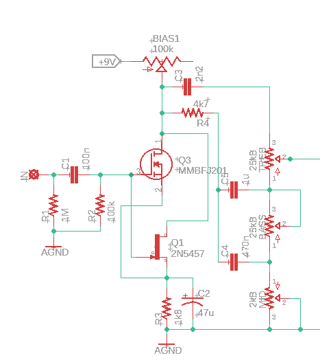
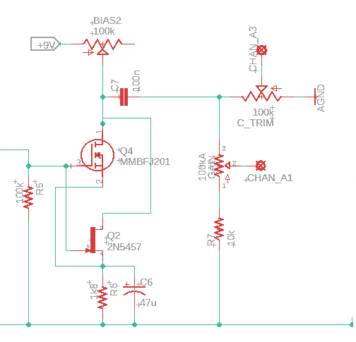
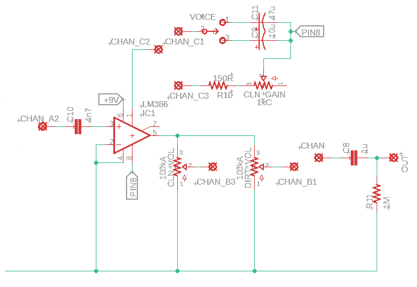
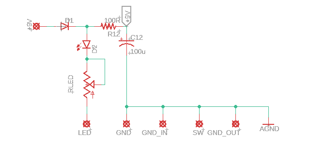

# Torivor

A Dual Channel Amp In a Box

")

Provided to the DIY community for non-commercial use by Brian Thornock, copyright 2022

## Overview

<paragraph index="34" node_type="writer">I generally don't do projects that fall in the boost/OD/dirt category. Part of that is because I'm a bit of an addict and have a bunch already. The other part is that there are so many of them. Everyone and their dog has “designed” a dirt pedal. They also aren't particularly challenging from a technical standpoint, so I tend to focus on other types of projects. However, one of my favorite drives is an LM386-based unit, but the tone control is one of those kind of lame, single-knob, adjustable-cutoff frequency RC filter types. The dirt is great, but the tone shaping is somewhat lacking. I decided that I wanted to do my own take on an LM386 circuit, including a full tone stack and the ability to do both clean and dirty tones with it.</paragraph>

## How it Works

### Torivor Initial Gain Stage and Tone Stack

 <paragraph index="38" node_type="writer">The Torivor consists of two main portions: a preamp and an LM386 power amp stage. The preamp itself consists of three main parts: initial gain stage, tone stack, and gain recovery stage. You can see below that the initial gain stage is based around a J201 JFET with fixed gain. This feeds a Fender-style tonestack, but I did two main changes to it. First, I scaled all the values for noise. The typical Fender values are great for an amp, but too noisy for a stompbox. Secondly, I changed the mid and treble characteristics so that it wasn't quite as bright. Because we are dealing with JFETs and an LM386, the tone stack was overly bright and needed to be tamed. In the end, it can still get plenty bright, but I found that the specified values work well for everything from a Telecaster-style guitar to a high output humbucker guitar. Do note that the controls are meant to be used and the extremes are still very usable, so don't be afraid to really twist the controls here.</paragraph>

### Torivor Gain Recovery Stage

 <paragraph index="42" node_type="writer">The gain recover stage takes the tone stack output and amplifies it so that we have a good, usable signal level going into our power amp. This is again just a basic JFET gain stage. You will notice that there are two solder pads at the output of this stage. One is directly off the output and the other goes through a voltage divider. In the distortion mode, the voltage divider works as the gain control with the LM386 configured for maximum voltage amplification (amplification fact of approximately 200). In clean mode, the full signal level is taken in to the LM386, but the amplification factor is significantly reduced to maintain a signal that ranges from spanky clean to just a little bit of breakup.</paragraph>

### Torivor Power Amp and Output

 <paragraph index="48" node_type="writer">The power amp stage is a fairly basic LM386 gain stage, with a couple of notable exceptions. First, there is quite a bit of switching around pin 1. This is to accomplish two separate goals. First is another set of lugs on the channel switch. As mentioned before, when set to distortion mode, the signal amplification is at maximum, though the electrolytic capacitors provide some amount of filtering of the low end that gets amplified. The 10 uF value is great for general purpose guitar signals while the 47 uF can give a bit more low end heft to the signal. Values here can be swapped around if you like, but keep in mind that the smaller caps will emphasize the high frequencies. I found that a 1 uF rolled of all the low frequencies and was rather unpleasant.</paragraph>

 <paragraph index="50" node_type="writer">Another difference is the fact that there is no tone shaping on the output. The output directly feeds two different volume controls. The active volume control is dependent on which signal is being used. A 4PDT stomp switch was used to do all the channel switching: 3 poles for the circuit configuration and one pole for the LED indicator. With this, you can use the volume controls to match between the two channels, or to provide a volume boost in distortion mode. Keep in mind that, because the LM386 is putting out so much signal in distortion mode, you may need to back the volume control off significantly.</paragraph>

 <paragraph index="52" node_type="writer">Another final note is that this really is a preamp pedal. The LM386 puts out enough voltage output that it could be run directly into a power amp. When I was playing with this into my computer with an amp sim, I had to keep the volume knobs down very low. Depending on how you intend to use it, you could reduce the signal level going into the volume pots by using a fixed voltage divider, but I wanted the flexibility to go directly into a power amp.</paragraph>

### Torivor Power Section

 <paragraph index="56" node_type="writer">The power section for this circuit is dead simple. Because everything is powered from 9V, have reverse polarity protection, indicator LED, and a filtering cap. Easy peasy.</paragraph>

## BOM

<paragraph index="65" node_type="writer">The BOM below is the list of parts I used for mine along with quantities. All parts are easily available through Tayda. All components are through hole with 1/4W resistors.</paragraph>

| <paragraph index="70" node_type="writer" parent_index="68">Part</paragraph> | <paragraph index="73" node_type="writer" parent_index="68">Qty.</paragraph> | <paragraph index="76" node_type="writer" parent_index="68">Notes</paragraph> |
| --- | --- | --- |
| <paragraph index="79" node_type="writer" parent_index="68">100R Resistor</paragraph> | <paragraph index="82" node_type="writer" parent_index="68">1</paragraph> |
| <paragraph index="88" node_type="writer" parent_index="68">1k5 Resistor</paragraph> | <paragraph index="91" node_type="writer" parent_index="68">1</paragraph> |
| <paragraph index="97" node_type="writer" parent_index="68">1k8 Resistor</paragraph> | <paragraph index="100" node_type="writer" parent_index="68">2</paragraph> |
| <paragraph index="106" node_type="writer" parent_index="68">4k7 Resistor</paragraph> | <paragraph index="109" node_type="writer" parent_index="68">1</paragraph> |
| <paragraph index="115" node_type="writer" parent_index="68">10k Resistor</paragraph> | <paragraph index="118" node_type="writer" parent_index="68">1</paragraph> |
| <paragraph index="124" node_type="writer" parent_index="68">100k Resistor</paragraph> | <paragraph index="127" node_type="writer" parent_index="68">2</paragraph> |
| <paragraph index="133" node_type="writer" parent_index="68">1M Resistor</paragraph> | <paragraph index="136" node_type="writer" parent_index="68">2</paragraph> |
| <paragraph index="142" node_type="writer" parent_index="68">2.2nF Capacitor</paragraph> | <paragraph index="145" node_type="writer" parent_index="68">1</paragraph> |
| <paragraph index="151" node_type="writer" parent_index="68">4.7nF Capacitor</paragraph> | <paragraph index="154" node_type="writer" parent_index="68">1</paragraph> |
| <paragraph index="160" node_type="writer" parent_index="68">100nF Capacitor</paragraph> | <paragraph index="163" node_type="writer" parent_index="68">2</paragraph> |
| <paragraph index="169" node_type="writer" parent_index="68">470nF Capacitor</paragraph> | <paragraph index="172" node_type="writer" parent_index="68">1</paragraph> |
| <paragraph index="178" node_type="writer" parent_index="68">1uF Capacitor</paragraph> | <paragraph index="181" node_type="writer" parent_index="68">2</paragraph> |
| <paragraph index="187" node_type="writer" parent_index="68">10uF Electrolytic Capacitor</paragraph> | <paragraph index="190" node_type="writer" parent_index="68">1</paragraph> |
| <paragraph index="196" node_type="writer" parent_index="68">47uF Electrolytic Capacitor</paragraph> | <paragraph index="199" node_type="writer" parent_index="68">3</paragraph> |
| <paragraph index="205" node_type="writer" parent_index="68">100uF Electrolytic Capacitor</paragraph> | <paragraph index="208" node_type="writer" parent_index="68">1</paragraph> |
| <paragraph index="214" node_type="writer" parent_index="68">100k Trimmer</paragraph> | <paragraph index="217" node_type="writer" parent_index="68">3</paragraph> | <paragraph index="220" node_type="writer" parent_index="68">3362 Type</paragraph> |
| <paragraph index="223" node_type="writer" parent_index="68">20k Trimmer</paragraph> | <paragraph index="226" node_type="writer" parent_index="68">1</paragraph> | <paragraph index="229" node_type="writer" parent_index="68">CLR for bypass LED</paragraph> |
| <paragraph index="232" node_type="writer" parent_index="68">2kB Potentiometer</paragraph> | <paragraph index="235" node_type="writer" parent_index="68">1</paragraph> |
| <paragraph index="241" node_type="writer" parent_index="68">25kC Potentiometer</paragraph> | <paragraph index="244" node_type="writer" parent_index="68">1</paragraph> |
| <paragraph index="250" node_type="writer" parent_index="68">25kB Potentiometer</paragraph> | <paragraph index="253" node_type="writer" parent_index="68">2</paragraph> |
| <paragraph index="259" node_type="writer" parent_index="68">100kA Potentiometer</paragraph>| <paragraph index="262" node_type="writer" parent_index="68">3</paragraph> |
| <paragraph index="268" node_type="writer" parent_index="68">SPDT Toggle Switch</paragraph> | <paragraph index="271" node_type="writer" parent_index="68">1</paragraph> |
| <paragraph index="277" node_type="writer" parent_index="68">1N5817</paragraph> | <paragraph index="280" node_type="writer" parent_index="68">1</paragraph> |
| <paragraph index="286" node_type="writer" parent_index="68">J201</paragraph> | <paragraph index="289" node_type="writer" parent_index="68">2</paragraph> |
| <paragraph index="295" node_type="writer" parent_index="68">LM386</paragraph> | <paragraph index="298" node_type="writer" parent_index="68">1</paragraph> |
| <paragraph index="304" node_type="writer" parent_index="68">LED</paragraph> | <paragraph index="307" node_type="writer" parent_index="68">2</paragraph> | Bypass LEDs |
| <paragraph index="313" node_type="writer" parent_index="68">Enclosure</paragraph>| <paragraph index="316" node_type="writer" parent_index="68">1</paragraph>| <paragraph index="319" node_type="writer" parent_index="68">125B</paragraph>|
| <paragraph index="322" node_type="writer" parent_index="68">1/4” input jack</paragraph>| <paragraph index="325" node_type="writer" parent_index="68">2</paragraph>|
| <paragraph index="331" node_type="writer" parent_index="68">DC power jack</paragraph>|<paragraph index="334" node_type="writer" parent_index="68">1</paragraph>|
| <paragraph index="340" node_type="writer" parent_index="68">DPDT footswitch</paragraph>| <paragraph index="343" node_type="writer" parent_index="68">1</paragraph>| <paragraph index="346" node_type="writer" parent_index="68">Compact recommended</paragraph>|

## Schematic

 <paragraph index="352" node_type="writer">The full schematic is shown below. It is also provided as a PDF in the project folder.</paragraph>

### Torivor Full Schematic

## Build Notes

<paragraph index="356" node_type="writer">Here are some things I noted from building the Torivor that might be helpful to you. Please read this section to make sure you don't go through excessive frustration.</paragraph>

### Enclosure Size/Drilling

 <paragraph index="360" node_type="writer">The Torivor can be made to fit inside a 125B, but I recommend a 1590BB. This gives more room for controls and footswitches. Top mount jacks work well, but use care in laying everything out, since the 1590BB doesn't have a ton of depth. A 125BB would also work and would have plenty of depth.</paragraph>

### Jacks

 <paragraph index="364" node_type="writer">You can use whatever jacks you prefer, as long as you are careful about the vertical space in the enclosure. I used standard box jacks.</paragraph>

### Tone Stack Tweaks

 <paragraph index="368" node_type="writer">If you would like to experiment with the tone stack, the resistor R4 has the greatest impact on high end. I recommend a tone stack calculator or sockets.</paragraph>

## In Closing
 <paragraph index="373" node_type="writer">This is a quick and fun project. I mean, who doesn't love more dirt? It's also an easy platform for modifying. Gain amounts, filter corners, etc. It's all fair game, so get in there and make one!</paragraph>
